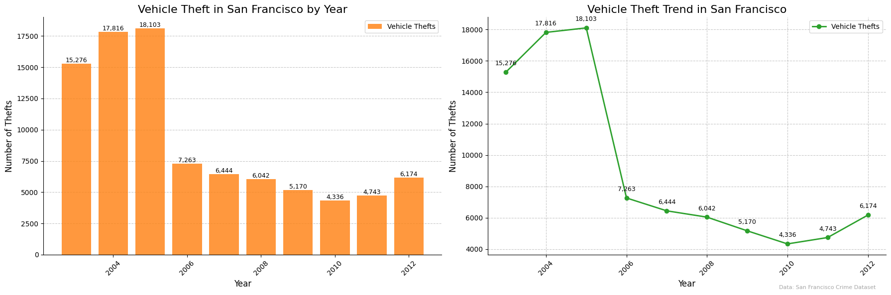

<head>
    <link rel="icon" href="assets/favicon.svg" type="image/x-icon">
</head>

# SF Crime Data Story 📊🚓

**Author:** Leonardo Rodovero  
**Email:** s240095@student.dtu.dk  
**Student Number:** s240095

## Introduction
San Francisco has seen various crime patterns evolve over time. In this micro-project, we explore SF crime data across several years, revealing key insights through visualization.

---

## 🔍 Insight 1: Crime Over Time
A look into the most frequent crime types over the last decade.

_The bar chart shows fluctuations in major crime categories._

---

## 🗺️ Insight 2: Crime Distribution by Location
Crime density varies heavily by location in SF.

<iframe src="assets/vehicle_theft_hotspots.html" width="100%" height="600px" frameborder="0"></iframe>

_This heatmap reveals hotspots, especially around downtown._

---

## 🌐 Insight 3: Interactive Exploration with Bokeh
Use the interactive tool below to explore crime types by category/year dynamically:

<iframe src="assets/vehicle_theft_by_day_of_week.html" width="100%" height="600px" frameborder="0"></iframe>

---

## 🔗 References
- [SF Chronicle Crime Reports](https://www.sfchronicle.com/)
- [SF OpenData Portal](https://data.sfgov.org/)